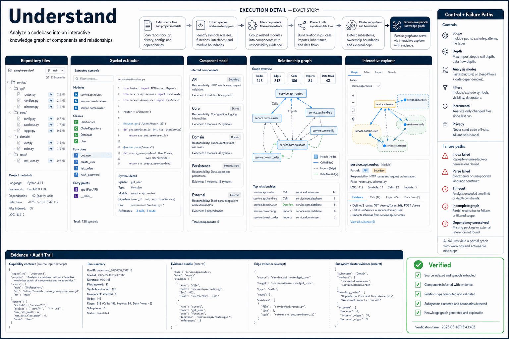

# How Understand Works

Analyze a codebase into an interactive knowledge graph of components and relationships.

## Stages

### 1. Index source files and project metadata

**Primary surface:** `Repository files`

Record the input, operation, observable output, and any decision that changes scope. Stop here if the output is missing, contradictory, or insufficient for the next stage.
### 2. Extract symbols modules and entry points

**Primary surface:** `Symbol extractor`

Record the input, operation, observable output, and any decision that changes scope. Stop here if the output is missing, contradictory, or insufficient for the next stage.
### 3. Infer components from code evidence

**Primary surface:** `Component model`

Record the input, operation, observable output, and any decision that changes scope. Stop here if the output is missing, contradictory, or insufficient for the next stage.
### 4. Connect calls imports and data flows

**Primary surface:** `Relationship graph`

Record the input, operation, observable output, and any decision that changes scope. Stop here if the output is missing, contradictory, or insufficient for the next stage.
### 5. Cluster subsystems and boundaries

**Primary surface:** `Interactive explorer`

Record the input, operation, observable output, and any decision that changes scope. Stop here if the output is missing, contradictory, or insufficient for the next stage.
### 6. Generate an explorable knowledge graph

**Primary surface:** `Interactive explorer`

Record the input, operation, observable output, and any decision that changes scope. Stop here if the output is missing, contradictory, or insufficient for the next stage.

## Failure handling

- **Authorization failure:** do not probe credentials or broaden access; report the missing authority.
- **Target ambiguity:** stop before mutation and request the minimum identifying information.
- **Tool or service failure:** retain error evidence, retry only safe transient failures, and cap retries.
- **Verification failure:** classify the run as incomplete even when the preceding operation returned success.

## Completion evidence

The handoff should contain the original request, inspection state, preview or plan, exact execution result, direct verification, and a final receipt naming limitations and withheld actions.
